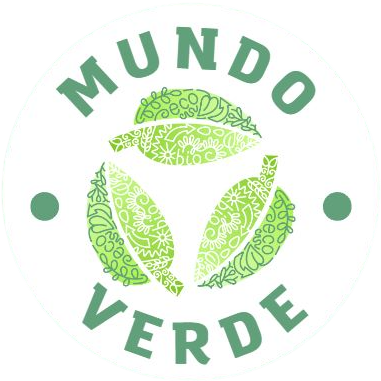

# mundo-verde

<h1 align="center"> -----🍃 Mundo Verde 🍃----- </h1>

<h2 align="center">Proyecto final - Codear Futura: Programación Web Frontend</h2>

Sitio web diseñado para concienciar acerca de la relevancia del reciclaje.

👩🏻‍💻👩🏻‍💻Realizado en grupo por las siguientes estudiantes:

- [Dahily Karina Manzano](https://github.com/dahilykm)
- [Janna Arrioja](https://github.com/jannaca)
- [Paula Tatiana Martínez](https://github.com/PaulaMartinezING)

📌Objetivo:
Crear un sitio web responsive.

🎨Tecnologías y buenas prácticas que se utilizaron:

- HTML Semántico.
- Propiedades CSS para modificar los textos, encabezados, img, colores, background y box modeling.
- Posicionamiento de elementos haciendo uso de flexbox y grid.
- Diseño Responsive.
- CDN de Bootstrap.
- SEO.

⚙ El proyecto no necesita de ninguna instrucción especial para ejecutarlo.
Solo conexión a internet y un navegador.

<h3> ----- 🌱 Live Demo 🌱----- </h3>

[Mundo Verde](https://jannaca.github.io/mundo-verde/)

Hecho con 💜 por [Estudiantes de Jump] 

